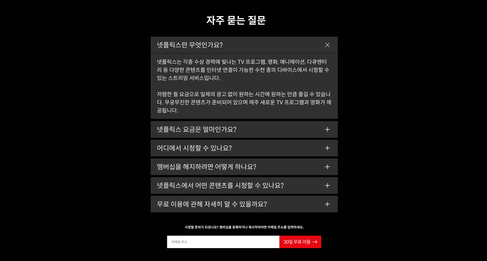

# 02. Netflix FAQ 클론

✅ Figma 디자인 파일을 분석해 `Netflix FAQ` 클론코딩
✅ 아코디언 UI 컴포넌트 설계하기

## 기능 요구사항

- accordion UI
    - handle 버튼을 클릭했을 때
        - [x] 해당하는 답변 내용을 보여줘야 한다.
        - [x] 창이 열릴 때 애니메이션 효과가 있어야 한다.
        - [x] 다른 질문 내용은 닫혀야 한다.
        - [x] 창이 열린 상태에서 클릭했을 경우, 창이 닫혀야 한다.
        - [x] `space` 또는 `enter`키로도 동작해야 한다. (버튼 기본)
    - [wai-aria-practice 접근성 참고](https://www.w3.org/TR/wai-aria-practices-1.1/examples/accordion/accordion.html)
- promotion form
  - [ ] 이메일 유효성 검사
