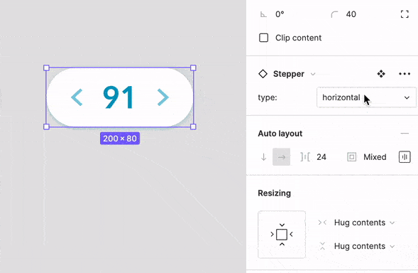

# 01. Stepper 컴포넌트 만들기 

✅ Figma 디자인 파일을 분석해 `stepper react 컴포넌트` 설계하기  

  

## 기능 요구사항

- 가급적 UI 디자인 시안과 최대한 비슷하게 구현해야 합니다. (글꼴, 크기, 색상, 간격, 효과 등)  
- 컴포넌트 모드, 상태 처리 등을 고려해 설계하세요. (mode, min, max, current, step 등)  
- 숫자 값 자리수에 따라 유연하게 좌우 버튼이 배치되도록 구현합니다. (너비 또는 높이 고정 X)  
- 컴포넌트 테스트 수행은 권장사항(옵션)입니다.